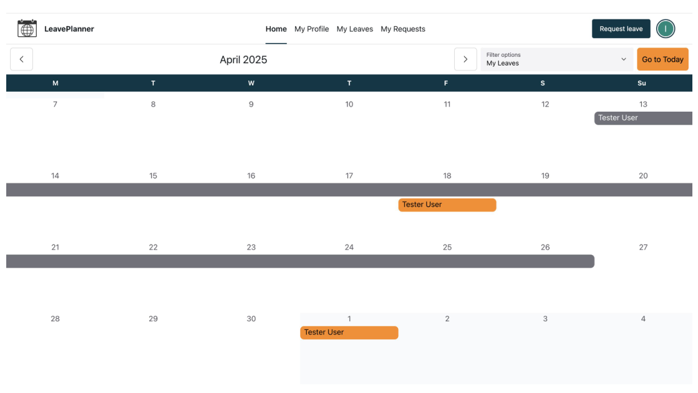
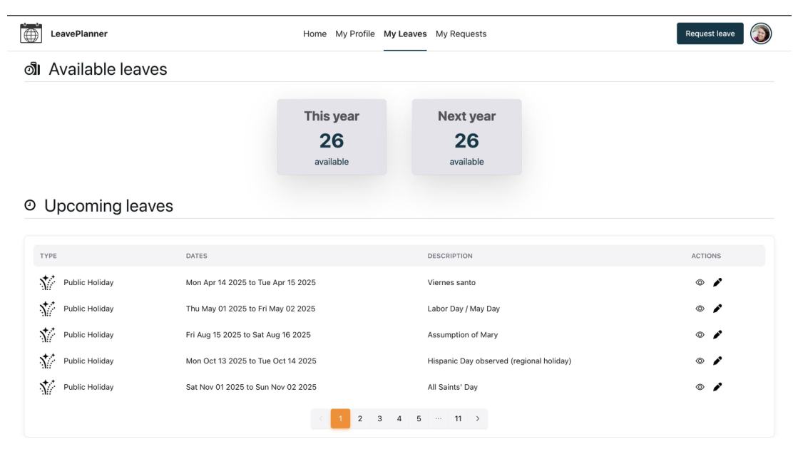
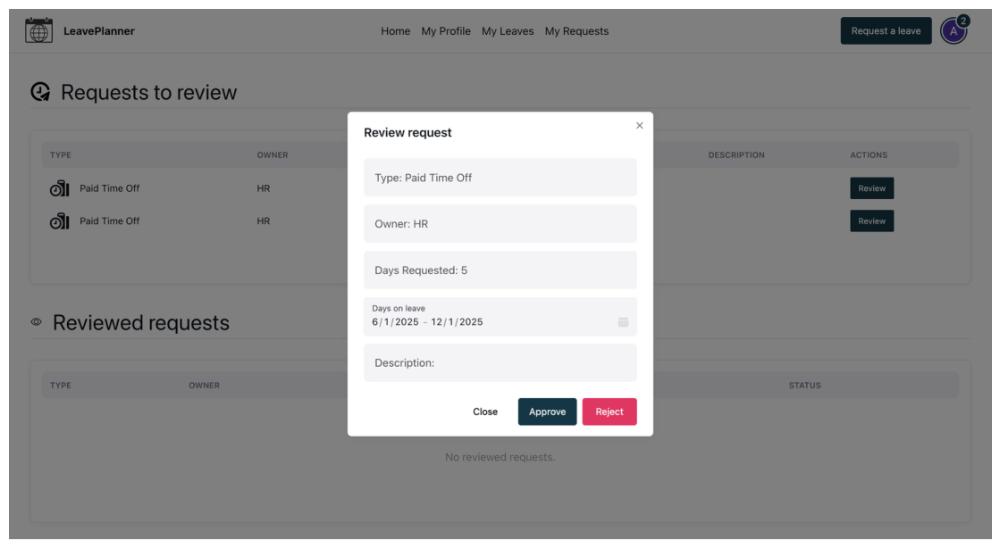
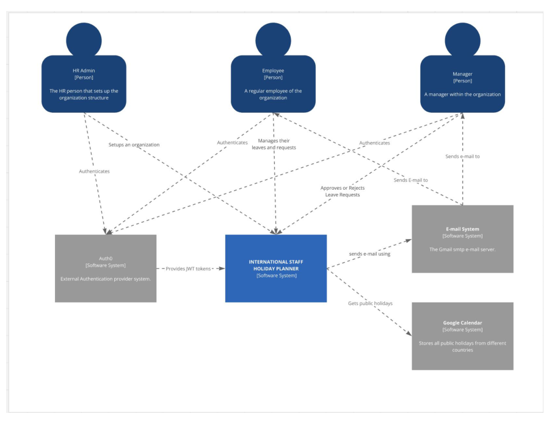
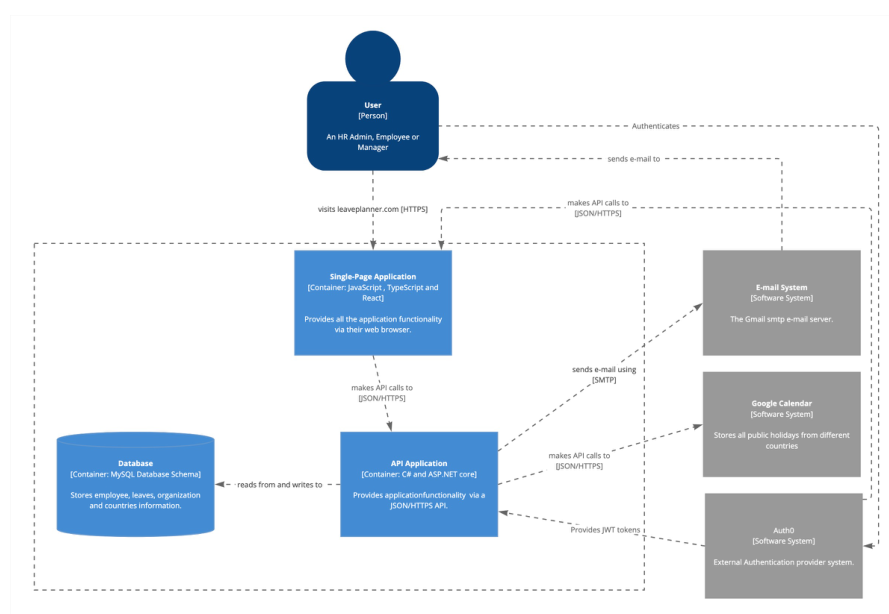
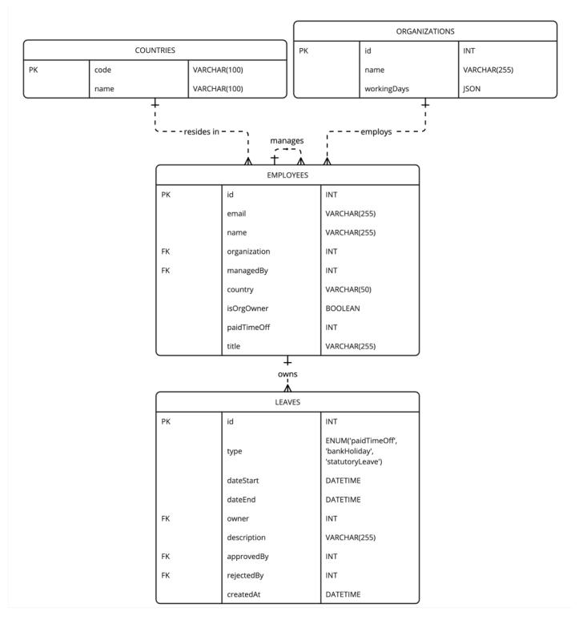

# LeavePlanner

A leave-management system for small organisations, built the way I'd build any product I had to own long-term: a real domain model underneath a calendar people actually want to use.

**React 18 + TypeScript · ASP.NET Core 8 · MySQL · Auth0 · CQRS via MediatR**

Originally designed and documented as a formal Final Degree Project in Computer Engineering (University of Cádiz, 2025) — modeled with the [C4 approach](https://c4model.com/), specified with 15 numbered business rules and 13 non-functional requirements, and evaluated against WCAG 2.1 AA and Lighthouse. The full 211-page writeup is in [`International Staff Holiday Planner.pdf`](International%20Staff%20Holiday%20Planner.pdf); this README pulls out what's relevant to reading the code.



---

## Why this repo

Most portfolio CRUD apps stop at forms over tables. This one exists to show the parts of full-stack work that CRUD apps skip: a domain layer with rules that are actually enforced, authorisation that can't be bypassed from the client, transactional writes that survive a cancelled request, and a calendar UI that reflects an org hierarchy instead of a flat list.

It's a single deployable — one API, one SPA — but internally it's laid out the way a larger system would be, so the architecture is visible without the operational overhead of running one.

---

## What it demonstrates

| | |
| --- | --- |
| **Domain-driven design** | Aggregates (`Leave`, `Employee`, `Organization`) own their invariants; `LeavePolicy` and `AccessPolicy` are first-class types with unit tests, not scattered `if`s in controllers |
| **CQRS** | Every write is a MediatR command against an aggregate; every read is a query building a DTO — reads never bypass the policies that reads and writes share |
| **Ports & adapters** | Handlers depend on `ILeaveRepository`, `IEmailSender`, `IPublicHolidayCalendar` — EF Core, SMTP, and Google Calendar are swappable adapters behind them |
| **Formal architecture modeling** | System documented with C4 Context/Container/Component diagrams and an ER diagram before implementation, not reverse-engineered after |
| **Correctness under real conditions** | Requests honour `HttpContext.RequestAborted`; failed commands roll back; email is a side effect of a committed domain event, not of a controller |
| **Frontend architecture** | Server state isolated to `src/models/*` hooks (TanStack Query owns cache/invalidation/abort); pages stay presentational |
| **Security posture** | JWT on every endpoint, authorisation resolved server-side and org-scoped, no passwords stored, secrets kept out of git with gitleaks in CI |
| **Quality bar with numbers behind it** | 100/93/100 Lighthouse accessibility across the three main pages, WCAG 2.1 AA, cross-browser/cross-device Playwright e2e |

---

## The product

LeavePlanner is for a company small enough that someone still needs to know who's off next week, and structured enough to have managers. The motivation was direct: as a team lead managing people across countries, I kept discovering a teammate was on a national holiday I hadn't accounted for, and kept manually cross-checking leave balances and team overlap before approving a request.

Roles fall out of the org tree rather than a separate permissions table:

- **Org owner** — configures working days, hires and imports people, is always the last admin standing (can't delete themselves into an orgless org)
- **Manager** — reviews their direct reports' requests, sees a pending-review badge in nav
- **Employee** — requests leave, sees remaining balance, cannot invent a public holiday

**Onboarding is a founder flow, not a 404.** A signed-in Auth0 user with no employee record is routed to "create an organisation" — the empty state is treated as a first-class product moment.

**The calendar is the home screen**, not a settings page bolted on. Filters are *My leaves*, *My circle* (you + your manager's team), and *All leaves*. Public holidays come from the Google Calendar API for the employee's country and are stored as pre-approved leaves, so they sit on the same timeline as everything else instead of living in a separate widget.

**Requesting leave validates before submit**: no past dates, no exceeding remaining balance (correct across a year boundary), working days minus already-blocking leave — and the preview surfaces **team conflicts** so a manager isn't the first to notice two people on the same team booked the same week.

**Leave taken by the org head auto-approves** (there's no one above them to ask); every other request raises a domain event that emails the manager and lands in a review queue.

| My Leaves | Reviewing a request |
| --- | --- |
|  |  |

### A sample of the business rules

Specifying the domain as numbered rules up front — rather than discovering them as edge cases in production — is what keeps `LeavePolicy` and `AccessPolicy` short and testable:

- Each organisation has exactly one head, the sole employee without a manager; organisations must always have at least one admin
- Employees can't have more than one manager, and only admins can edit employee details
- Paid time off must be between 1 and 365 days/year; leave can't be requested in the past or more than two years ahead
- Bank holidays are assigned per employee based on country and can be moved but not deleted or invented by the employee
- Non-working days and bank holidays never subtract from an employee's PTO balance
- There's no cap on statutory leave — it's not the same budget as PTO

---

## Architecture

The system was modeled with [C4 diagrams](https://c4model.com/) before the first commit — context first, then containers, then components — which is the same order they're useful for a reader here.

**Context** — who and what the system talks to:



**Containers** — the SPA and API are the only two deployables; everything else is a managed dependency:



Clean architecture without extra assemblies: Domain, Application, and Infrastructure are folders inside one ASP.NET Core project, not separately-deployed services. Splitting them into their own assemblies wouldn't have changed the design — the seam that matters is that `Application` handlers only ever talk to interfaces defined in `Domain/Ports`, and `Infrastructure` is the only layer that knows EF Core, SMTP, or Google exist.

**Request path.** Controllers are deliberately thin — they bind the request's `CancellationToken`, dispatch a MediatR command or query, and translate a `Result<T>` into an HTTP status. `[AdminOnly]`, `[SelfAccessOnly]`, `[ManagerOnly]` filters run before the handler and consult the same `AccessPolicy` the domain uses internally, so "can this manager approve this leave" has exactly one implementation, not one in the API layer and a second one the UI assumes.

**Writes.** A command opens a transaction (`IUnitOfWork`), mutates an aggregate — `Leave.Submit`, `Employee.Hire`, `Organization.Rename` — collects the domain events that mutation raised, commits, then dispatches those events. Email goes out *after* commit, as a reaction to `LeaveSubmitted`, not as something the controller remembers to do. The cancellation token flows through EF, the Google Calendar client, and SMTP, so a client that disconnects mid-request actually stops the work instead of completing it silently.

**Reads.** Queries build DTOs directly but still go through `LeavePolicy` and `WorkingDayCalculator` for anything derived — remaining balance and "which dates are blocked" are computed once, not reimplemented per query.

**Results, not exceptions, for expected failures.** Handlers return `Result<T>` (`Success` / `Invalid` / `NotFound`); an `UnhandledExceptionBehavior` MediatR pipeline step is the backstop for anything that *isn't* expected, and cancellation is never logged as a crash.

### Data model

`Leave` and leave-review-`Request` share one table by design — both are the same shape (type, date range, owner, approver, description) and splitting them would have meant duplicating that shape and reconciling two tables on every query that needs "everything blocking this date range." `Employee` carries its own hierarchy (`managedBy`) rather than a separate org-chart table, which is what lets a manager's reports, an org's headcount, and "who approves this" all fall out of one self-referencing relationship instead of three.



### Layout

```
LeavePlanner/
├── frontend/          React 18 SPA — CRA, NextUI, Tailwind, Playwright
├── API/
│   ├── Controllers/   HTTP entrypoints + authorisation attributes
│   ├── Application/   MediatR commands/queries, LeaveEvaluator, org import
│   ├── Domain/        Leave, Employee, Organization, policies, events, ports
│   ├── Infrastructure Persistence (EF/MySQL) + Auth0-unaware email/calendar adapters
│   ├── Middlewares/   Access filters
│   └── Models/        API DTOs — never the domain entities themselves
├── tests/             xUnit — domain rules, not framework plumbing
├── DB/                Schema
└── docs/              README assets
```

---

## Decisions worth reading

A few choices that were deliberate trade-offs, not defaults:

- **One deployable, not a service mesh.** DDD and CQRS earn their keep by making a codebase's seams honest, not by requiring separately-operated services. Splitting this into microservices would add deployment surface without adding a single capability.
- **One `Leaves` table, not two.** See [Data model](#data-model) — collapsing `Leave` and `Request` into one shape traded a small amount of column reuse for not having to reconcile two tables every time something needs "all entries blocking this date range."
- **Auth0 owns passwords; this app never touches one.** There's no password column in the schema. The API validates a bearer token and resolves the caller from the `email` claim — which means a Post-Login Action in Auth0 that copies `email` onto the access token is required infrastructure, not an optional nicety (see [Run it locally](#run-it-locally)).
- **A process-lifetime `HttpClient` for Google Calendar**, registered as a singleton with `PooledConnectionLifetime` — a new client per call is the textbook way to exhaust sockets under load; the pooled lifetime keeps DNS changes from getting stuck.
- **Config fails at boot, not on the first request.** `AppOptions`, `Auth0Options`, `EmailOptions`, and `GoogleCalendarOptions` are bound and validated with `ValidateOnStart()` before the app accepts traffic — a missing `Auth0:Domain` is a startup error naming the key, never a 500 the first time someone requests leave.
- **Secrets sized to the actual risk.** User-secrets locally, environment variables in deploy, gitleaks scanning every push in CI. A secrets vault is the right next step once credential *distribution* is the bottleneck — introducing one before that point is process for its own sake.

---

## Quality

Numbers from the project's own accessibility, performance, and cross-platform testing, run with Google Lighthouse and Playwright and written up in the thesis (§8):

| | Home | My Leaves | Setup Organisation |
| --- | --- | --- | --- |
| Accessibility (WCAG 2.1 AA) | 100 | 93¹ | 100 |
| Performance | 94 | 92 | 93 |

¹ The remaining gap on My Leaves is contrast and markup inside a NextUI pagination component that isn't customisable from application code.

Getting to 100 wasn't automatic — it came from fixing specific, named issues: low-contrast text on secondary-coloured buttons, and a navigation bar whose list items weren't wrapped correctly for screen readers. Both fixes are in the current codebase, not just the writeup.

E2E coverage runs the two journeys that must not regress (organisation setup, employee leave request) with Playwright across Chromium, Firefox, and WebKit, at both desktop and mobile viewports (Pixel 5, iPhone 12) — manager-review journeys are covered manually rather than in CI, a scoping call made explicit rather than left unstated.

---

## Stack

| Layer | Choice |
| --- | --- |
| SPA | React 18, TypeScript, React Router, NextUI, Tailwind, Luxon |
| Data fetching | TanStack Query v5 — `AbortSignal` wired to `fetch`, cache/invalidation owned per model |
| Auth | Auth0 SPA SDK + JWT bearer, `email` claim as the identity |
| API | ASP.NET Core 8, MediatR 12, EF Core 8 + MySQL |
| Mail | FluentEmail / SMTP — off by default in development, logs what it would have sent |
| Holidays | Google Calendar public-holiday calendars, per employee country |
| Testing | xUnit (domain), Playwright (e2e), gitleaks (CI secret scanning) |

---

## Run it locally

Needs **.NET 8**, **Node 18+ / Yarn**, **MySQL**, and an **Auth0** tenant.

### 1. Auth0

1. **Applications → Create Application** → *Single Page Application*, note the **Client ID**.
   - Allowed Callback URLs: `https://localhost:3000/home`
   - Allowed Logout URLs / Web Origins: `https://localhost:3000`
2. **APIs → Create API**, set *Identifier* to `https://api.leaveplanner.org` (this becomes `Audience`).
3. Under **Actions → Library → Build Custom**, add and deploy a Login / Post Login action:

   ```js
   exports.onExecutePostLogin = async (event, api) => {
     api.accessToken.setCustomClaim('email', event.user.email)
   }
   ```

   The API resolves the caller by the `email` claim (`NameClaimType = "email"`), so this step isn't optional.
4. If you'll run e2e tests, use a second tenant with a Username-Password-Authentication connection and one dedicated test user — don't point Playwright at a real account.

### 2. Database

```bash
mysql -u root -p < DB/database_schema.sql
```

Then create a least-privilege application user — the API should never connect as `root`:

```sql
CREATE USER 'leaveplanner_app'@'%' IDENTIFIED BY 'a-strong-generated-password';
GRANT SELECT, INSERT, UPDATE, DELETE ON LeavePlanner.* TO 'leaveplanner_app'@'%';
FLUSH PRIVILEGES;
```

### 3. API

Nothing secret is committed. Configuration is read in order: `appsettings.json` → environment variables → user-secrets (development).

Fill in the non-secret values in `API/appsettings.Development.json` (`Auth0:Domain`, `Auth0:Audience`) — a template is at `API/appsettings.Example.json`. Then store secrets outside the repo:

```bash
cd API
dotnet user-secrets init
dotnet user-secrets set "ConnectionStrings:LeavePlannerDB" \
  "server=127.0.0.1;port=3306;user=leaveplanner_app;password=...;database=LeavePlanner"
dotnet user-secrets set "GoogleCalendar:ApiKey" "your-google-calendar-api-key"

dotnet run
```

HTTPS listens on `https://localhost:7247`. Email is off by default (`Email:Enabled: false`, logs instead of sending); to send for real:

```bash
dotnet user-secrets set "Email:Password" "your-smtp-app-password"
```

For Gmail this is an **App Password**, not the account password. Any missing or malformed setting fails the boot with a message naming the key.

### 4. Frontend

```bash
cd frontend
yarn install
cp .env.example .env.development   # fill in REACT_APP_AUTH0_*
yarn setup:certs                   # generates a self-signed localhost cert
yarn start
```

Runs at `https://localhost:3000` — Auth0 requires HTTPS for the callback. The browser will ask you to trust the self-signed cert once.

### 5. Tests

```bash
dotnet test tests/LeavePlanner.Domain.Tests     # domain rules

cd frontend
cp .env.example .env.local                      # fill in E2E_USER / E2E_PASSWORD
yarn test                                        # Playwright — API + frontend must be running
```

Playwright authenticates once in `globalSetup.ts` and reuses the session from a gitignored `auth.json`.

### 6. Deployment

Set secrets as environment variables on the host, replacing `:` with `__`:

```bash
ConnectionStrings__LeavePlannerDB="server=...;user=leaveplanner_app;password=...;database=LeavePlanner"
GoogleCalendar__ApiKey="..."
Email__Password="..."
```

Everything else is read from `appsettings.json`. (The thesis documents an earlier deployment on AWS — CloudFront + S3 for the SPA, EC2 for the API, RDS for MySQL, Route 53 + Certificate Manager for TLS — as one concrete way to run this in production; it isn't the only one.)

---

## Configuration reference

| Setting | Secret | Local | Deployed |
| --- | --- | --- | --- |
| `ConnectionStrings:LeavePlannerDB` | yes | user-secrets | `ConnectionStrings__LeavePlannerDB` |
| `GoogleCalendar:ApiKey` | yes | user-secrets | `GoogleCalendar__ApiKey` |
| `Email:Password` | yes | user-secrets | `Email__Password` |
| `Email:FromAddress` | no | `appsettings.Development.json` | `appsettings.json` |
| `App:FrontendUrl` | no | `appsettings.Development.json` | `appsettings.json` |
| `Auth0:Domain` / `Auth0:Audience` | no | `appsettings.Development.json` | `appsettings.json` |
| `REACT_APP_AUTH0_*` | no | `frontend/.env.development` | build environment |
| `E2E_USER` / `E2E_PASSWORD` | password only | `frontend/.env.local` | CI repository secrets |

The Auth0 domain and SPA client ID ship in the browser bundle and live in configuration because they're environment-specific — not because they're confidential.

CI runs [gitleaks](.github/workflows/secret-scan.yml) over full history on every push (`gitleaks protect --staged` locally). If a credential is ever exposed, rotate it — a published secret is compromised regardless of what happens to the history afterward.

---

## License

See [LICENSE](LICENSE).
