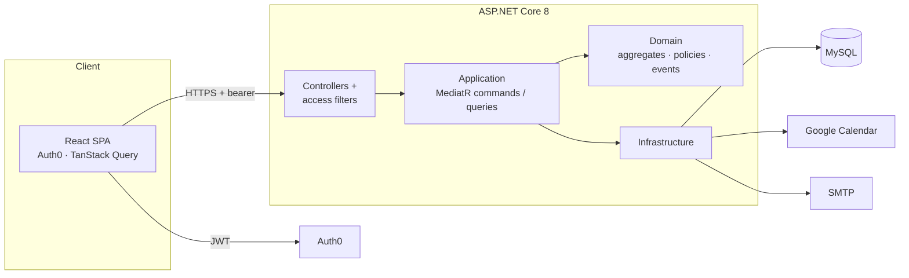

# LeavePlanner

Leave and absence planning for small organisations — a full-stack product covering calendar UX, org hierarchy, approval workflows, and the domain rules that make those safe.

React + TypeScript SPA · ASP.NET Core 8 API · MySQL · Auth0

<!--
  SCREENSHOT: save the capture as docs/calendar.png (see “Screenshot” below).
  Until that file exists, GitHub will show a broken image — that is expected.
-->


Built as a complete product I would be comfortable owning as a full-stack engineering manager: domain model, UX, architecture, and the operational details that keep it safe to run.

---

## Screenshot

**Put one hero image here: the home calendar on “My Circle’s Leaves”.**

That view is the product in a single frame. Capture a month that is visually full:

- Four to six teammates with overlapping PTO bars (not a sparse empty grid)
- A public holiday and a statutory leave so the three types are obvious
- The month title, filter, and “Go to Today” visible
- The nav showing a pending-review badge if you are signed in as a manager

Use a wide desktop window (around 1440px), real-looking names, and a month that is not empty. Avoid Auth0 chrome, browser debug bars, and dummy emails like `test@test.com`.

A second image is optional, not required. If you add one, the **organisation tree** on Setup organisation is the strongest follow-up — it shows hierarchy, admin, and CSV import as a designed workflow rather than a CRUD list. Save it as `docs/org-tree.png` and link it under [Product](#product).

---

## What it demonstrates

| Area | In this repo |
| --- | --- |
| **Product** | Self-serve org bootstrap, role-aware navigation, calendar as the primary surface, conflict-aware approvals |
| **Architecture** | CQRS + MediatR, a real domain layer (aggregates, policies, events), ports & adapters inside one deployable |
| **Frontend** | Auth0 SPA, TanStack Query, a custom month calendar, NextUI + Tailwind |
| **Safety** | JWT on every endpoint, authorisation in the domain, secrets out of source, fail-fast config, gitleaks in CI |
| **Quality** | Domain unit tests for the rules that hurt if they drift; Playwright e2e for admin and employee journeys |

---

## Product

LeavePlanner is for a company that is small enough to care who is off next week, and structured enough to have managers.

**Roles** fall out of the org tree, not a separate permission matrix:

- **Org owner** — sets working days, hires and imports people, remains the last admin
- **Manager** — reviews direct reports’ requests, with a badge for what is waiting
- **Employee** — requests PTO or statutory leave, sees remaining days, cannot invent public holidays

**First-run.** A signed-in Auth0 user with no employee record is prompted to create an organisation. That is a product decision: the empty state is a founder flow, not a 404.

**Calendar** is the home screen. Filters are *My leaves*, *My circle* (manager + peers), and *All leaves* in the organisation. Public holidays are pulled from Google Calendar for the employee’s country and stored as approved bank-holiday leaves, so they occupy the same timeline as PTO.

**Requesting leave** validates before submit: no past dates, no more days than remaining (including ranges that cross a year boundary), working days minus already-blocking leave. The preview also surfaces **team conflicts** so a manager is not the first person to notice two people in the same team are off together.

**Org head leave** auto-approves — there is no manager above them. Everyone else raises a domain event; the manager is emailed and reviews from a dedicated queue.

---

## Architecture

One ASP.NET app, layered in-process. That is intentional: this is a product, not a platform. CQRS, DDD, and ports live as folders and types, not as extra services to operate.



**Request path.** Controllers are thin. They bind the HTTP abort token, send a MediatR request, and map a `Result` to an HTTP status. Authorisation attributes (`AdminOnly`, `SelfAccessOnly`, `ManagerOnly`, …) run first and consult the same `AccessPolicy` the domain uses — so “can this manager approve this leave?” is not reinvented in the UI.

**Writes.** Commands open a transaction, mutate an aggregate (`Leave.Submit`, `Employee.Hire`, `Organization.Rename`, …), collect domain events, commit, then dispatch. Email is a side effect of the event, not of the controller. If the client disconnects mid-flight, EF, Google Calendar, and SMTP observe the cancellation token; rollbacks still complete so a cancelled request cannot leave a half-written row.

**Reads.** Queries compose DTOs for the calendar, remaining PTO, and conflict lists. They do not bypass policy: remaining days and blocking dates go through `LeavePolicy` and `WorkingDayCalculator`.

### Repository layout

```
LeavePlanner/
├── frontend/          React 18 SPA (Create React App, NextUI, Tailwind, Playwright)
├── API/
│   ├── Controllers/   HTTP + auth attributes
│   ├── Application/   CQRS handlers, LeaveEvaluator, org import
│   ├── Domain/        Leave, Employee, Organization, policies, events
│   ├── Infrastructure Persistence, Auth0-unaware email/calendar adapters
│   ├── Middlewares/   Access filters
│   └── Models/        API DTOs (not domain entities)
├── tests/             Domain unit tests (xUnit) — the rules, not the framework
├── DB/                Schema
└── docs/              README screenshots
```

The frontend keeps server communication in `src/models/*` hooks. Pages do not fetch. React Query owns cache, invalidation, and aborting in-flight GETs when a view unmounts or the calendar month changes.

---

## Decisions worth reading

**Clean architecture inside one project.** Splitting Domain/Application/Infrastructure into extra assemblies would not have changed the design, only the solution file. The seam that matters is that handlers talk to ports (`ILeaveRepository`, `IEmailSender`, `IPublicHolidayCalendar`), and EF / SMTP / Google live behind those ports.

**Domain owns the rules.** “You cannot take more PTO than you have left”, “org head leave is auto-approved”, “you cannot delete the last admin”, “a manager only reviews their own reports in the same org” are not scattered if-statements in controllers. They are policies and aggregate methods with unit tests. That is what lets a calendar UI stay dumb and still be correct.

**Auth0 holds passwords; this app never does.** The API validates a bearer token and resolves the caller by email claim. There is no password column. The trade-off is an Auth0 tenant and a Post-Login action that copies `email` onto the access token — documented below because it is required, not optional.

**Typed results, not exception-as-control-flow for expected failures.** Handlers return `Result<T>` (`Invalid`, `NotFound`, `Success`). Unexpected exceptions are logged and fail the request. Cancellation is not logged as a crash.

**One long-lived `HttpClient` for Google Calendar.** A new client per resolve is how you exhaust sockets. The process-lifetime client uses `PooledConnectionLifetime` so DNS can still refresh.

**Right-sized secrets.** User-secrets locally, environment variables in deploy, gitleaks on every push. A vault is the right next step when credential *distribution* becomes a process problem — not before.

**Config fails at boot.** Missing `Auth0:Domain` or a connection string does not become a 500 on the first leave request. Options are validated with DataAnnotations at startup.

---

## Strengths of the system

- **The calendar is a product, not a date picker.** Circle vs org vs self, public holidays on the same grid, remaining-day math that respects working days and already-approved leave.
- **Hierarchy is data.** Managers, badges, auto-approval, and admin scope all derive from who reports to whom — including CSV import of a whole tree.
- **Authorisation is server-side and org-scoped.** An org owner cannot administer another organisation; a manager cannot approve a stranger’s request. The SPA hiding a menu is not the security boundary.
- **Cancellations and transactions are honest.** Aborted HTTP work stops; a failed command rolls back; emails go out after commit.
- **The test split matches the risk.** Domain tests cover PTO math, access, hiring, and conflicts. Playwright covers the two user journeys that must not regress (admin setup, employee request). CI scans history for leaked secrets.

---

## Stack

| Layer | Choice |
| --- | --- |
| SPA | React 18, TypeScript, React Router, NextUI, Tailwind, Luxon |
| Data fetching | TanStack Query v5 (`signal` passed to `fetch`) |
| Auth | Auth0 SPA + JWT bearer (`email` as name claim) |
| API | ASP.NET Core 8, MediatR 12, EF Core + MySQL |
| Mail | FluentEmail / SMTP (off by default in development) |
| Holidays | Google Calendar public-holiday calendars |
| Tests | xUnit (domain), Playwright (e2e), gitleaks (CI) |

---

## Run it locally

You need **.NET 8**, **Node 18+ / Yarn**, **MySQL**, and an **Auth0** tenant.

### 1. Auth0

Create two tenants if you will run e2e — one for development, one for tests — so test users never share a directory with real ones.

In each tenant:

1. **Applications → Create Application** → *Single Page Application*. Note the **Client ID** (public).
   - *Allowed Callback URLs*: `https://localhost:3000/home`
   - *Allowed Logout URLs* and *Allowed Web Origins*: `https://localhost:3000`
2. **APIs → Create API**. Set the *Identifier* to `https://api.leaveplanner.org` — this is the `Audience`.
3. Add the user's email to the access token. Under **Actions → Library → Build Custom**, add a Login / Post Login action and deploy it:

   ```js
   exports.onExecutePostLogin = async (event, api) => {
     api.accessToken.setCustomClaim('email', event.user.email)
   }
   ```

   The API resolves the caller by the `email` claim (`NameClaimType = "email"`), so this action is required.
4. For the test tenant, enable a **Username-Password-Authentication** database connection and create one test user. The e2e suite must not drive a real Google account.

### 2. Database

```bash
mysql -u root -p < DB/database_schema.sql
```

Then create a least-privilege application user. The API should never connect as `root`:

```sql
CREATE USER 'leaveplanner_app'@'%' IDENTIFIED BY 'a-strong-generated-password';
GRANT SELECT, INSERT, UPDATE, DELETE ON LeavePlanner.* TO 'leaveplanner_app'@'%';
FLUSH PRIVILEGES;
```

### 3. API

Nothing secret is committed. ASP.NET Core reads `appsettings.json`, then environment variables, then user-secrets in development.

Fill in the non-secret values in `API/appsettings.Development.json` (`Auth0:Domain`, `Auth0:Audience`). Templates: `API/appsettings.Example.json`. Then store secrets outside the repository:

```bash
cd API
dotnet user-secrets init
dotnet user-secrets set "ConnectionStrings:LeavePlannerDB" \
  "server=127.0.0.1;port=3306;user=leaveplanner_app;password=...;database=LeavePlanner"
dotnet user-secrets set "GoogleCalendar:ApiKey" "your-google-calendar-api-key"

dotnet run
```

The HTTPS profile listens on `https://localhost:7247`. User-secrets are written to `~/.microsoft/usersecrets/`, outside the working tree.

Email is off by default (`Email:Enabled: false`); the service logs what it would have sent. To send for real, set `Email:Enabled` to `true`, set `Email:FromAddress`, and add the password:

```bash
dotnet user-secrets set "Email:Password" "your-smtp-app-password"
```

For Gmail this is an **App Password** (Google Account → Security → 2-Step Verification → App passwords), not the account password.

Any missing or malformed setting **fails the boot** with a message naming the key.

### 4. Frontend

```bash
cd frontend
yarn install
cp .env.example .env.development   # fill in REACT_APP_AUTH0_*
yarn setup:certs                   # generates localhost.key / localhost.crt
yarn start
```

The app is at `https://localhost:3000`. Auth0 requires HTTPS for the callback. The certificate is self-signed and gitignored; the browser will ask you to trust it once.

### 5. Domain tests

```bash
dotnet test tests/LeavePlanner.Domain.Tests
```

### 6. E2E tests

Playwright signs in once in `globalSetup.ts` and caches the session in `auth.json` (gitignored). The API and frontend must already be running.

```bash
cd frontend
cp .env.example .env.local   # fill in E2E_USER and E2E_PASSWORD
yarn test
```

### 7. Deployment

Set secrets as environment variables on the host, replacing `:` with `__`:

```bash
ConnectionStrings__LeavePlannerDB="server=...;user=leaveplanner_app;password=...;database=LeavePlanner"
GoogleCalendar__ApiKey="..."
Email__Password="..."
```

Everything else comes from `appsettings.json`.

---

## Configuration reference

| Setting | Secret | Local | Deployed |
| --- | --- | --- | --- |
| `ConnectionStrings:LeavePlannerDB` | **yes** | user-secrets | `ConnectionStrings__LeavePlannerDB` |
| `GoogleCalendar:ApiKey` | **yes** | user-secrets | `GoogleCalendar__ApiKey` |
| `Email:Password` | **yes** | user-secrets | `Email__Password` |
| `Email:FromAddress` | no | `appsettings.Development.json` | `appsettings.json` |
| `App:FrontendUrl` | no | `appsettings.Development.json` | `appsettings.json` |
| `Auth0:Domain` / `Auth0:Audience` | no | `appsettings.Development.json` | `appsettings.json` |
| `REACT_APP_AUTH0_*` | no | `frontend/.env.development` | build environment |
| `E2E_USER` / `E2E_PASSWORD` | **password only** | `frontend/.env.local` | CI repository secrets |

The Auth0 domain and SPA client ID are public identifiers that ship in the browser bundle. They live in configuration because they are environment-specific, not because they are confidential.

---

## Secret handling

CI scans the full history with [gitleaks](.github/workflows/secret-scan.yml) on every push:

```bash
gitleaks protect --staged
```

Enabling GitHub **push protection** (Settings → Code security) adds a server-side block.

If a credential is ever exposed, rotate it first. A published secret stays compromised no matter what the history says afterwards.
